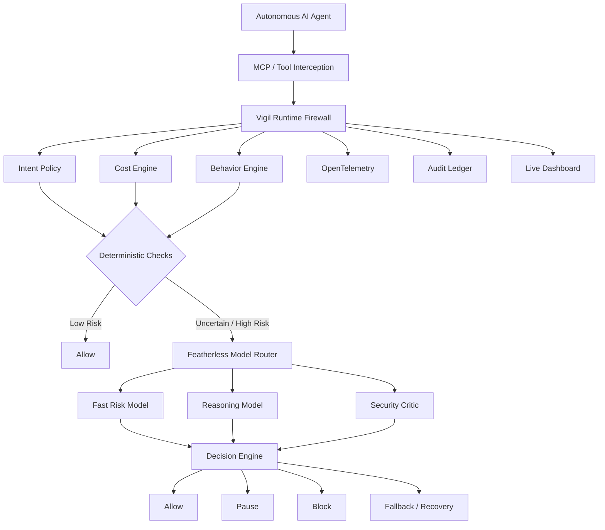
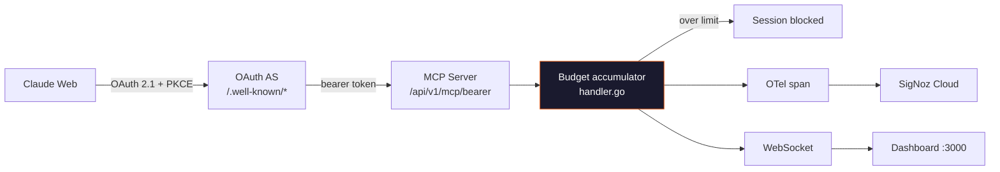
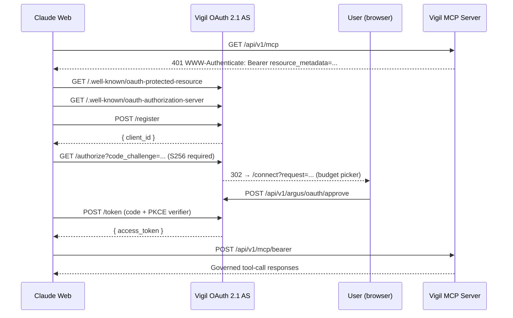

<div align="center">

# Vigil

## The Runtime Firewall for Autonomous AI Agents

**Vigil sits between autonomous AI agents and their tools, continuously evaluating intent, behavior, cost, and security risk — then allowing, pausing, rerouting, or blocking actions in real time.**

[](https://go.dev)
[](https://nextjs.org)
[](https://modelcontextprotocol.io)
[](https://oauth.net/2.1/)
[](https://opentelemetry.io)
[](./LICENSE)
[](./SECURITY.md)

</div>

---

> ### 📋 Read this first — implementation status
>
> This README documents **Vigil 2.0**, which is part shipped and part in-design. Every section is tagged:
>
> | Tag | Meaning |
> |---|---|
> | ✅ **Shipped** | Implemented, wired into a request path, and covered by a test or a verified run |
> | ⚠️ **Partial** | Code exists and compiles, but is **not reachable** from the running server |
>
> No benchmark, latency, cost-saving, or accuracy number appears in this document unless it was measured. Where a figure would normally go and no measurement exists, it says **"not measured."**
>
> **Naming:** packages, binaries, routes, and environment variables all use `vigil` / `VIGIL_*`. Two deprecated compatibility shims remain so deployments provisioned before the rename keep working: `/api/v1/argus/*` still routes to the canonical prefix, and any `ARGUS_*` variable is honored when its `VIGIL_*` counterpart is unset.

---

## Table of Contents

1. [Product definition](#1-product-definition)
2. [The problem](#2-the-problem)
3. [Why current agent runtimes are insufficient](#3-why-current-agent-runtimes-are-insufficient)
4. [The Vigil solution](#4-the-vigil-solution)
5. [Architecture](#5-architecture)
6. [Featherless integration](#6-featherless-integration--shipped)
7. [Adaptive model routing](#7-adaptive-model-routing--shipped)
8. [Predictive cost firewall](#8-predictive-cost-firewall)
9. [Intent-aware governance](#9-intent-aware-governance--shipped)
10. [AI security judge](#10-ai-security-judge--shipped)
11. [Self-healing and fallback](#11-self-healing-and-fallback)
12. [Tamper-evident audit trail](#12-tamper-evident-audit-trail--shipped)
13. [Tech stack](#13-tech-stack)
14. [Quick start](#14-quick-start)
15. [Environment variables](#15-environment-variables)
16. [Test commands](#16-test-commands)
17. [Demo command](#17-demo-command)
18. [Current implementation status](#18-current-implementation-status)
19. [Security limitations](#19-security-limitations)
20. [Hackathon submission](#20-hackathon-submission)

---

## 1. Product definition

**Vigil is a runtime firewall for autonomous AI agents.** It intercepts tool calls at the Model Context Protocol transport layer, evaluates each one against declared intent, behavioral baseline, and a live cost budget, and returns an allow / pause / block / fallback decision before the tool executes.

Vigil is **not** a chatbot, a general AI assistant, a generic observability dashboard, a model-comparison tool, or a compliance-certification platform.

Vigil **is** runtime governance, adaptive enforcement, cost control, behavioral anomaly detection, intent-aware policy, AI-assisted risk evaluation, safe model routing, recovery/fallback, and auditable execution.

---

## 2. The problem

Autonomous agents built on MCP call tools — file reads, shell commands, code search, network requests — with no metering, no budget ceiling, and no behavioral baseline.

A single prompt-injected loop, a stuck planner, or a misgeneralized instruction can:

- burn thousands of tool calls before a human notices;
- exfiltrate data through an unrestricted shell tool;
- exhaust an API budget in minutes;
- take a destructive action that no policy ever explicitly permitted.

The failure mode is not that the agent breaks. It is that the agent works *exactly as designed* while doing something nobody sanctioned.

---

## 3. Why current agent runtimes are insufficient

| Existing approach | Why it falls short |
|---|---|
| **Prompt-level guardrails** | Advisory, not enforcing. The model can be argued out of them. |
| **Static tool allowlists** | Binary and context-free. `run_command` is either on or off — no notion of *this* command in *this* session. |
| **Post-hoc observability** | Tells you what the agent already did. The spend is spent; the file is deleted. |
| **Per-call rate limits** | Blind to semantics. Ten cheap calls that exfiltrate a secret look healthier than one expensive legitimate call. |
| **Human approval on every call** | Destroys the autonomy that made the agent useful. |

The missing layer is a **control plane on the hot path** that understands what the session was *for*, what the agent *normally* does, what the action *costs*, and what the action *means* — and that can act before execution rather than after.

---

## 4. The Vigil solution

Every tool call passes through a decision pipeline:

```
AGENT
  → MCP TOOL CALL
  → VIGIL INTERCEPTION
  → INTENT / COST / BEHAVIOR CHECK       (deterministic, always)
  → AI RISK JUDGE                        (only when deterministic checks are uncertain)
  → ALLOW / PAUSE / BLOCK / FALLBACK
  → TELEMETRY
  → AUDIT TRAIL
  → LIVE DASHBOARD
```

Two design commitments shape everything below:

1. **Deterministic first, model second.** Cheap, explainable, reproducible checks run on every call. A language model is consulted only when those checks are genuinely uncertain. This bounds both latency and inference cost.
2. **The model never has final authority.** Model output is schema-validated and range-checked before it can influence a decision, and it can never *relax* a deterministic block. On malformed output, timeout, or provider failure, the system falls back to deterministic rules — fail-closed.

---

## 5. Architecture



### What is wired today



### OAuth 2.1 + PKCE sequence ✅ Shipped



---

## 6. Featherless integration ✅ Shipped

Implemented in `pkg/query-service/vigil/llm/`. An OpenAI-compatible client (`net/http` + `encoding/json`, no SDK) against `https://api.featherless.ai/v1`.

> **The live-credential path has not been exercised.** No key was available during development. The client is covered by 12 tests against an `httptest` OpenAI-compatible server — retry on 503/429, no-retry on 401, timeout, downward-only fallback, key redaction — but it has never spoken to the real API. Treat that specific claim as unverified until you configure a key and run `make demo`.

A provider abstraction with three model roles, selected by risk and confidence rather than called on every event:

| Role | Invoked when | Requirement |
|---|---|---|
| `FAST_RISK_CLASSIFIER` | Deterministic checks are uncertain | Lowest latency available model |
| `POLICY_REASONER` | Fast classifier returns low confidence; also for policy compilation | Mid-tier reasoning model |
| `DEEP_SECURITY_REVIEWER` | Reasoner flags HIGH/CRITICAL | Strongest available model |

Client requirements: environment-variable credentials, bounded timeouts, retries with bounded exponential backoff, graceful cross-model fallback, and capture of latency, token usage, model ID, and request/trace ID where the provider returns them. Secrets must never be logged or exposed to the frontend.

> Model identifiers are deliberately **not defaulted anywhere in the code.** `NewFeatherless` errors if `VIGIL_MODEL_FAST` / `_REASONER` / `_REVIEWER` are unset. Catalogues change, and a hardcoded ID that has since been retired fails in production rather than in review — pick current ones from <https://featherless.ai/models>.
>
> With no credentials the router falls back to `DeterministicProvider`, which returns `ErrNoModel` rather than a synthesized verdict. "No credential configured" therefore travels the exact same fail-closed path as "the provider timed out", and no fabricated risk score can enter the audit chain.

---

## 7. Adaptive model routing ✅ Shipped

Routing by risk tier, so that expensive inference is the exception:

```
NORMAL      → deterministic checks           → ALLOW          (no inference)
SUSPICIOUS  → fast classifier                → ALLOW / escalate
UNCERTAIN   → policy reasoner                → decision
HIGH RISK   → policy reasoner → security reviewer → decision
```

**Cost-aware routing.** When the cost engine projects a budget breach, the correct response is usually not to kill the agent. The router should check whether a cheaper configured model can serve the remaining work, switch route if safe, log the decision with before/after projected cost, and continue. Killing is reserved for the hard limit.

---

## 8. Predictive cost firewall

### ✅ Shipped

Per-session cost accounting. Each tool call carries a fixed price (`mcp/tools.go`), accumulates onto the session total, and when the total crosses the session's budget the session is marked blocked and every subsequent call is refused with an explanatory result (`mcp/handler.go`). Budgets are chosen by the user during the OAuth consent step; the ceiling is configurable via `ARGUS_BUDGET_LIMIT`.

> **Known defect:** the accumulator is a shared global rather than per-session, so a per-agent cost shown in the dashboard currently reflects the fleet total. This is a real bug, not a display quirk. Tracked in the roadmap.

### ✅ Shipped — forecasting

Upgrade from post-hoc accounting to prediction, using a **transparent deterministic forecast** — no machine learning, and no claim of any:

```
burn_rate        = Δcost / Δtime            over a rolling window of recent calls
projected_total  = current_cost + burn_rate × remaining_session_time
time_to_breach   = (budget − current_cost) / burn_rate
```

Thresholds: a **soft limit** that triggers cost-aware model routing and a dashboard warning, and a **hard limit** that blocks. Edge cases the implementation must handle explicitly: insufficient history, zero burn rate (no breach — do not divide by zero), and negative or zero remaining budget.

Target dashboard panel:

```
CURRENT     $0.78          BUDGET          $2.00
BURN RATE   $0.21/min      PROJECTED       $2.71
TIME TO BREACH  5m 42s     RECOMMENDED     SWITCH TO LOWER-COST MODEL
```

Values above are **illustrative formatting, not measured output.**

---

## 9. Intent-aware governance ✅ Shipped

Today's governance is context-free: a tool is allowed or it isn't. Vigil 2.0 binds each session to a **declared intent** at creation:

> "Fix failing tests in this repository. You may read source files, modify project files, and run tests. Do not use network access or access secrets. Maximum budget: $2."

That statement compiles into a structured policy — allowed tools, denied tools, allowed and denied resource categories, budget, risk tolerance, and optional network and secret-access policies. Every intercepted call is then evaluated against it, and **every decision is explainable**:

```
ALLOW  run_tests    — permitted by declared intent
BLOCK  curl ...     — network access violates declared intent
```

### AI policy generator

A dashboard field accepts natural-language policy; a reasoning model compiles it to structured JSON. The model output is then put through: schema validation → allowed-field validation → normalization → dangerous-rule detection → policy compilation → **explicit human confirmation before activation**.

The generator is a drafting aid. It must never mutate security-sensitive runtime state on its own authority.

---

## 10. AI security judge ✅ Shipped

For calls that survive deterministic screening but remain uncertain, a structured evaluation request carries: declared intent, requested tool, tool arguments, recent tool history, current budget state, the relevant policy, and the deterministic risk signals already detected.

The model must return strict JSON:

```json
{
  "risk_score": 0,
  "severity": "LOW|MEDIUM|HIGH|CRITICAL",
  "decision": "ALLOW|PAUSE|BLOCK|FALLBACK",
  "reasons": [],
  "intent_violation": false,
  "confidence": 0.0
}
```

Validation is mandatory: strict schema check, enum membership, `risk_score` within 0–100, `confidence` within 0–1. On malformed output, retry once; on second failure, timeout, or provider error, fall through to deterministic rules. **Malformed model output must never reach the decision engine, and the model may never downgrade a deterministic block.**

---

## 11. Self-healing and fallback

### ✅ Shipped — now wired

The recovery engine and its eight actions are now constructed at startup and reachable from the tool-call path. The load-bearing change is one closure in `appserver/stack.go`: the governance engine always invoked a recovery hook per violation, it simply never had one.

A ninth action was added — `ActionAlert` previously had **no** registered handler, so the three detectors that emit it (agent stuck, tool timeout, prompt recursion) fell through to a "no action registered" warning and notified nobody. Unlike the eight pre-existing stubs, it does real work and returns failure when delivery fails.

### Four narrow, reliable paths

Deliberately *not* a general autonomous repair system:

| Trigger | Recovery |
|---|---|
| Projected budget breach | Switch to a lower-cost model if one is configured and safe |
| Transient model failure | Fall back to another configured model |
| Dangerous tool action | Pause or block |
| Repeated failure | Circuit breaker |

Every recovery decision is logged and surfaced as `DETECTED → ANALYZED → ACTION → RESULT`.

---

## 12. Tamper-evident audit trail ✅ Shipped

Not a blockchain — a **SHA-256 hash chain**. Each event records: event ID, timestamp, agent ID, session ID, tool, arguments hash, decision, reason, model used, cost, previous event hash, current event hash. Chaining each hash over its predecessor makes any retroactive edit, deletion, or reordering detectable.

Verification is a first-class command:

```bash
vigil audit verify SESSION_ID
# PASS — 187 events verified
# FAIL — tampering detected at event 72
```

---

## 13. Tech stack

| Layer | Technology | Status |
|---|---|---|
| Core runtime | Go 1.25, `gorilla/mux` | ✅ |
| Real-time transport | Gorilla WebSocket | ✅ |
| Auth | Self-hosted OAuth 2.1 AS, PKCE S256 | ✅ |
| Protocol | Model Context Protocol `2024-11-05` | ✅ |
| Observability | OpenTelemetry SDK, OTLP/HTTP exporter | ✅ |
| Telemetry backend | SigNoz Cloud (`service.name = vigil-control-plane`) | ✅ |
| Frontend | Next.js 16, React 19, Tailwind CSS 4 | ✅ |
| Cost accounting | Per-session accumulator | ✅ |
| Governance plugin engine | Custom Go plugin pipeline | ✅ 6 of 9 detectors (see §18) |
| Behavioral baseline (Agent DNA) | ClickHouse-backed statistics | ⚠️ not reachable |
| Trace store / replay | ClickHouse via SigNoz `TelemetryStore` | ⚠️ not reachable |
| Python SDK | `vigil-sdk` | ✅ tests pass |
| Inference | Featherless multi-model router | ✅ offline-tested; live key unverified |
| Audit ledger | SHA-256 hash chain (JSONL) | ✅ |
| Testing | Go `testing` (stdlib only), `unittest` | ✅ 106 Go tests across 10 packages |
| Deployment | Docker, Compose, Railway, Render, Netlify | ✅ manifests present |

This project is a fork of [SigNoz](https://github.com/SigNoz/signoz); the upstream module path and observability packages are retained.

---

## 14. Quick start

### Prerequisites

| Requirement | Version | Purpose |
|---|---|---|
| Go | `>= 1.25` | Backend (module declares `go 1.25.0`) |
| Node.js | `>= 20` | Dashboard |
| SigNoz Cloud account | free tier | Trace ingestion — **optional**, backend runs without it |

### 1 — Configure

```bash
cp .env.example .env.local     # see §15 for the full variable list
```

### 2 — Backend

```bash
go run ./cmd/argus-server
```

Listens on `:8080`. Without SigNoz credentials it logs a warning and continues — telemetry export is skipped, everything else runs.

### 3 — Dashboard

```bash
cd frontend && npm install && npm run dev
```

Open <http://localhost:3000>.

> Point the dashboard at your local control plane with `VIGIL_BACKEND_URL=http://localhost:8080 npm run dev`. For the live event stream also set `NEXT_PUBLIC_VIGIL_WS_URL=ws://localhost:8080/api/v1/vigil/ws` — Next rewrites cannot proxy WebSocket upgrades, so that one has no server-side fallback.

### 4 — Docker

```bash
docker compose -f docker-compose.prod.yaml up --build
```

### Connect an MCP client

| Client | Method |
|---|---|
| Claude Web | OAuth 2.1 + PKCE — "Add to Claude Web" on the Plugins page |
| Claude Code | `claude mcp add --transport http vigil http://localhost:8080/api/v1/mcp` |
| Claude Desktop / Cursor / VS Code | SSE — config shown on the Plugins page |

### MCP tools exposed

| Tool | Price | Status |
|---|---|---|
| `read_file` | $0.001 | ✅ real |
| `search_code` | $0.002 | ✅ real (ripgrep) |
| `list_directory` | $0.001 | ✅ real |
| `analyze_codebase` | $0.005 | ✅ real |
| `run_command` | $0.003 | ✅ real — **disabled by default**, see §19 |
| `vigil_list_agents` | $0.001 | ✅ real |
| `vigil_cost_status` | $0.001 | ✅ real |
| `vigil_agent_dna` | $0.002 | ⚠️ returns a placeholder string |
| `signoz_query_traces` | $0.002 | ⚠️ returns a placeholder string |
| `signoz_get_services` | $0.001 | ⚠️ returns a placeholder string |
| `signoz_list_alerts` | $0.001 | ⚠️ returns a placeholder string |
| `signoz_create_dashboard` | $0.005 | ⚠️ returns a placeholder string |

Prices are Vigil's internal metering weights for budget accounting — they are not provider billing figures.

---

## 15. Environment variables

The canonical list lives in [`.env.example`](./.env.example), which is annotated. Copy it to `.env.local` — that is the file `cmd/vigil-server` reads, not `.env`:

```bash
cp .env.example .env.local
```

**Vigil runs with none of them set.** Intent policy, cost forecasting, and the behavioral detectors all work with no credentials of any kind. The optional groups buy AI judgement, trace export, and persistence.

The ones worth knowing:

| Variable | Default | Effect |
|---|---|---|
| `VIGIL_BUDGET_LIMIT` | `100` | Per-session spend ceiling (USD) |
| `VIGIL_ALLOW_EXEC` | `false` | **Must be enabled deliberately** — see §19 |
| `VIGIL_AUDIT_PATH` | `./vigil-audit.jsonl` | Where the hash chain is written |
| `VIGIL_PUBLIC_BASE` | `http://localhost:8080` | Advertised in OAuth discovery; must be externally reachable in production |
| `VIGIL_FEATHERLESS_API_KEY` | unset | Unset ⇒ deterministic-only, no model consulted |
| `VIGIL_MODEL_FAST` / `_REASONER` / `_REVIEWER` | **no defaults** | Model IDs per role; construction fails if none are set |
| `VIGIL_SOFT_LIMIT_PCT` | `0.80` | Fraction of budget at which a cheaper route is recommended |
| `OTEL_EXPORTER_OTLP_*` | unset | Unset ⇒ trace export skipped, everything else runs |
| `VIGIL_BACKEND_URL` | `http://localhost:8080` | Dashboard → control plane (server-side only) |
| `NEXT_PUBLIC_VIGIL_WS_URL` | `ws://localhost:8080/api/v1/vigil/ws` | Live event stream; browser-side by necessity |

Any `ARGUS_*` variable is still honored when its `VIGIL_*` counterpart is unset, so pre-rename deployments keep working.

> Backend secrets must never carry the `NEXT_PUBLIC_` prefix — that ships the value to the browser. The only `NEXT_PUBLIC_` variable Vigil defines is the WebSocket URL, which is not a secret.

---

## 16. Test commands

```bash
go build ./...                                    # passes
go vet ./pkg/query-service/vigil/... ./cmd/...    # clean
go test -race ./pkg/query-service/vigil/...       # 106 tests, 10 packages, all pass
make vigil-test                                   # same, via the Makefile
```

Everything runs offline with no credentials. The Featherless client is exercised against an `httptest` OpenAI-compatible server, so its retry, timeout, and fallback behavior is *more* deterministic without a key than with one.

| Area | Cases | Package |
|---|---|---|
| Concurrency & sessions | 13 | `mcp` |
| Audit chain | 11 | `audit` |
| Inference client & router | 12 | `llm` |
| Intent policy & generator | 27 | `policy` |
| Forecast, judge, pipeline | 32 | `firewall` |
| Pre-existing (engine, cost, dna, recovery, replay) | 11 | various |

Python SDK:

```bash
cd vigil-sdk && python -m pytest tests/ -q        # 2 passed
```

### Not run in this environment

- **The upstream SigNoz suite** (`tests/`, 137 pytest files + 9 Playwright specs) — testcontainers-based, requires a Docker daemon, and tests SigNoz features unrelated to Vigil. Out of scope.
- **`docker build`** — no Docker daemon available here.
- **Live Featherless calls** — no key configured.

---

## 17. Demo command

```bash
./demo/run_demo.sh          # or: make demo
./demo/run_demo.sh --scene 4   # one scene, for debugging
```

Builds and starts a server if none is running, or adopts one already on `:8080` — and only ever kills what it started, so it is safe to run against a dev server you already have open. Verified: **7/7 scenes pass** with no credentials configured.

| Scene | What it demonstrates |
|---|---|
| 1 — Normal operation | Three compliant calls → ALLOW, **no model consulted** |
| 2 — Suspicious behavior | A tight tool loop → the loop detector fires |
| 3 — AI judgement | With a key, an escalated verdict. Without one, it says so plainly. |
| 4 — Runtime intervention | `curl` and `.env` read → BLOCKED at the intent stage, before execution |
| 5 — Predictive cost | Real burn rate, projected total, and time to breach |
| 6 — Recovery / routing | Soft limit → recommend a cheaper route rather than killing the agent |
| 7 — Audit | The whole chain verified, allows and blocks both recorded |

Independently checkable afterwards:

```bash
go run ./cmd/vigil-cli audit verify        # PASS — N events verified
python3 demo/verify.py                     # 20/20 checks
```

**Provenance rules the demo obeys.** The harness identifies itself as `Vigil Demo Harness` during MCP `initialize`, so every event it causes is labelled `demo=true` **at the source** rather than by a server-wide mode flag — a real agent connecting mid-demo is not mislabelled. Only the *stimulus* is synthetic; every decision shown comes from the real governance engine on the real tool-call path. No external API success is ever simulated: with no credentials, scene 3 reports that no model was consulted instead of inventing a risk score.

---

## 18. Current implementation status

| Component | Status | Detail |
|---|---|---|
| MCP server + protocol | ✅ | Real JSON-RPC, 12 tools |
| OAuth 2.1 AS | ✅ | PKCE S256 verified, codes hashed + single-use + 2-min TTL, `redirect_uri` checked, tokens hashed at rest |
| **Governance engine** | ✅ | **Now wired.** 6 detectors registered and firing on the live tool-call path |
| **Recovery engine** | ✅ | **Now wired.** 9 actions registered, including the previously-missing `ActionAlert` |
| Intent policy | ✅ | Declared intent compiled and enforced per call, with explainable reasons |
| Predictive cost firewall | ✅ | Rolling-window burn rate, projected total, time-to-breach, soft + hard limits |
| Per-session cost isolation | ✅ | Fixed — each session accumulates only its own spend |
| AI security judge | ✅ | Strict schema/enum/range validation, retry-once, deterministic fallback |
| Featherless router | ✅ | Offline-tested against `httptest`; **live-credential path unverified** |
| Audit hash chain | ✅ | SHA-256 JSONL, `vigil-cli audit verify`, tamper/missing/reorder all detected |
| OTel export | ✅ | Nesting decision → model-call spans; blocks surface as span errors |
| Dashboard | ✅ | 9 pages; decision stream, predictive cost, model router, policy generator |
| Tool containment | ✅ | `run_command` off by default; filesystem tools confined to the project root |
| **ClickHouse-backed features** | ⚠️ | `cmd/vigil-server` still passes `nil` for the telemetry store, so Agent DNA baselines, prompt replay, and real cost queries remain unreachable in the standalone binary |
| 3 of 9 detectors | ⚠️ | See below |

### Why only 6 of 9 detectors

`TokenExplosion`, `RepeatedPrompt`, and `PromptRecursion` read `InputTokens`, `OutputTokens`, and `PromptText`. **An MCP tool call carries none of those** — Vigil intercepts *tool* calls, not the agent's LLM turns. Registering them would be dead code presented as coverage, so `/vigil/governance/rules` reports the six that are registered and says why in a note. They become registerable when an SDK-side span-ingest path exists.

### What FALLBACK actually does

Vigil does not run the agent's model, so it cannot execute a model switch on the agent's behalf. A `FALLBACK` verdict degrades to ALLOW plus a recovery event and a dashboard recommendation. Building a fake fallback executor would have been worse than saying this.

### Roadmap

- [x] OAuth 2.1 + PKCE authorization server
- [x] Wire the governance engine into the live path
- [x] Fix the concurrent-map panic, cost attribution, and charge-before-execute ordering
- [x] Intent policy · predictive forecast · AI judge · Featherless router · audit chain
- [x] Dashboard panels and env-driven backend URL
- [ ] Verify the live Featherless path with a real credential
- [ ] Pass real SigNoz dependencies in `cmd/vigil-server` to unlock DNA and replay
- [ ] Authenticate the agent-control endpoints (§19)
- [ ] SDK-side span ingest, which makes the remaining 3 detectors registerable
- [ ] Retire the `argus` compatibility shims once no old clients remain

---

## 19. Security limitations

Stated directly, because a security product that hides its own gaps is worse than one making no security claims.

### Fixed in 2.0

- **`run_command` no longer runs by default.** It required no gate at all; it now needs `VIGIL_ALLOW_EXEC=true` and refuses a destructive-pattern list even when enabled.
- **Filesystem tools are confined.** `read_file` and `list_directory` rejected `..` but accepted any absolute path, so `read_file("/etc/passwd")` worked. Both now resolve through one shared check (`Abs` + `EvalSymlinks` + project-root prefix).
- **The concurrent-map panic is gone.** The session table was read and written from every HTTP handler with no lock — a hard `concurrent map writes` crash, not a benign race. Regression-tested under `-race`.
- **Cost is charged only for work that ran.** A refused call used to be billed anyway.
- **Governance is genuinely on the hot path.** Previously only a budget counter enforced anything.

### Still open

**Control endpoints have no authorization.** `POST /api/v1/vigil/agents/{id}/kill|pause|resume` and the MCP session `block`/`budget` endpoints are unauthenticated behind a permissive `Access-Control-Allow-Origin: *`. Anyone who can reach the host can kill any agent or raise any session's budget. Do not expose this build to an untrusted network.

**Unknown sessions get a default budget on first contact.** An unauthenticated POST with an invented `X-MCP-Session-ID` creates a governed-but-permitted session. This is precisely why `VIGIL_ALLOW_EXEC` defaults to false.

**Shell execution remains dangerous when enabled.** The deny-list is a floor against catastrophic commands, not a boundary — shell quoting has more ways to spell `rm -rf /` than a list can enumerate. Real containment is the off-by-default gate plus intent policy. Before enabling it anywhere shared: command allowlist, restricted working directory, OS-level resource limits, non-root container user.

**The audit chain is tamper-evident, not tamper-proof.** Anyone who can rewrite the whole file can recompute the whole chain. It proves the file has not been *selectively* edited, which is a different and weaker claim than immutability.

**The model is trusted for judgement, never for authority.** Output is schema-, enum-, and range-validated, and can only make a decision stricter. But a model that consistently under-reports risk would cause escalated calls to be allowed that a better model would have blocked. Deterministic checks are the floor, not the model.

### Scope

No third-party penetration test has been performed. No compliance certification is claimed or implied. See [`SECURITY.md`](./SECURITY.md).

---

## 20. Hackathon submission

**Impact Forge Summer 2026**

**Title:** Vigil 2.0 — The Runtime Firewall for Autonomous AI Agents

**One-liner:** Vigil sits between autonomous AI agents and their tools, evaluating intent, behavior, cost, and security risk on every call, and allowing, pausing, rerouting, or blocking in real time.

**Who it's for:** developers running autonomous coding agents, teams operating MCP-based agentic workflows, and anyone who has handed an agent a shell and a budget.

### What makes it different

Most agent-safety work picks one axis. Vigil's thesis is that **intent, behavior, and economics are the same problem**: an agent that violates its declared purpose usually also deviates from its behavioral baseline *and* spends abnormally. Correlating all three produces a decision that any one signal alone would miss — and correlating them cheaply, with deterministic checks screening before any inference, is what makes it viable on the hot path.

The second idea: **cost is a governance signal, not a billing detail.** A projected budget breach should trigger a cheaper model route, not a kill. Economic pressure becomes an input to enforcement rather than an afterthought.

### Judging points

| Criterion | What to look at |
|---|---|
| Technical execution | Real MCP interception, working OAuth 2.1 + PKCE AS, real OTel export, budget enforcement on the hot path |
| Originality | Intent + behavior + economics correlated; deterministic-first, model-second routing; cost as an enforcement input |
| Utility | Drop-in MCP server — any Claude/Cursor/VS Code agent is governed without changing agent code |
| Engineering honesty | §18 and §19 state exactly what is and is not wired, with no invented metrics. The one unverified claim — the live Featherless path — is labelled as such in four places rather than glossed. |

### Demo storyline (3 minutes)

**0:00–0:30** — An agent is given a shell and a $2 budget. It starts working normally; Vigil allows each call and the live event stream fills.
**0:30–1:15** — The agent attempts a network call that its declared intent forbids. Deterministic checks flag it as uncertain and escalate; the risk judge returns a high-risk verdict; Vigil blocks it *before execution*. The reason is human-readable.
**1:15–2:00** — Burn rate climbs. Vigil projects a breach in under six minutes and switches to a cheaper model route instead of killing the session. Projected cost drops; the agent keeps working.
**2:00–2:45** — `vigil audit verify` walks the hash chain and confirms the blocked event is intact and unmodified.
**2:45–3:00** — The whole run in SigNoz, as spans.

> Verified: `./demo/run_demo.sh` passes 7/7 scenes with no credentials configured. Scene 3 is the one caveat — without a Featherless key it reports that no model was consulted rather than showing a model verdict, which is the honest behavior, not a stand-in.

---

<div align="center">

Built on **Go**, **Next.js**, **OpenTelemetry**, **Model Context Protocol**, and **OAuth 2.1**.

Forked from [SigNoz](https://github.com/SigNoz/signoz) · [Security policy](./SECURITY.md) · [License](./LICENSE)

</div>
