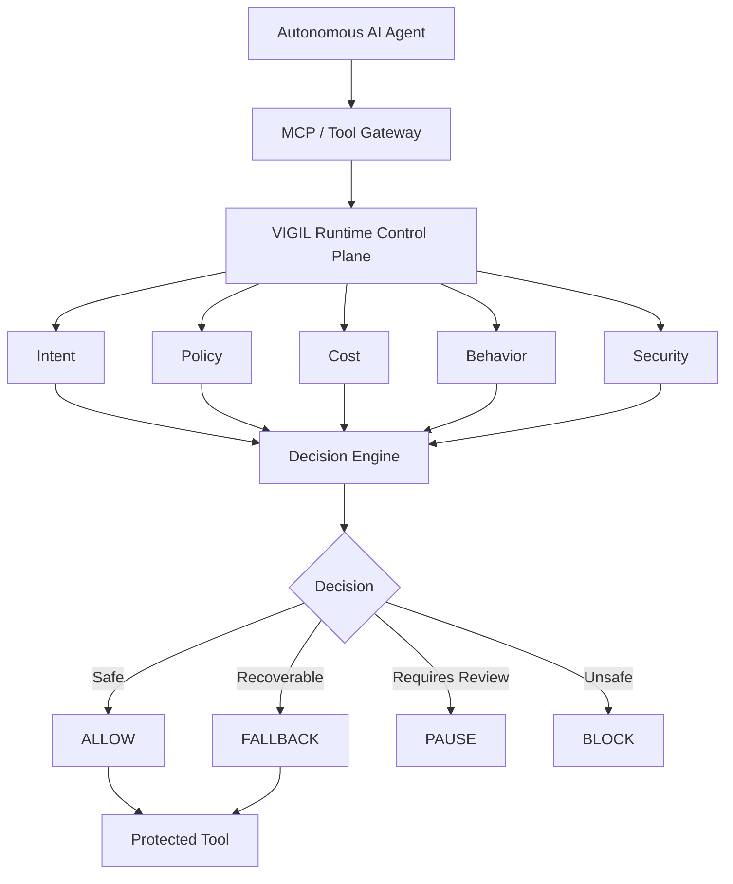
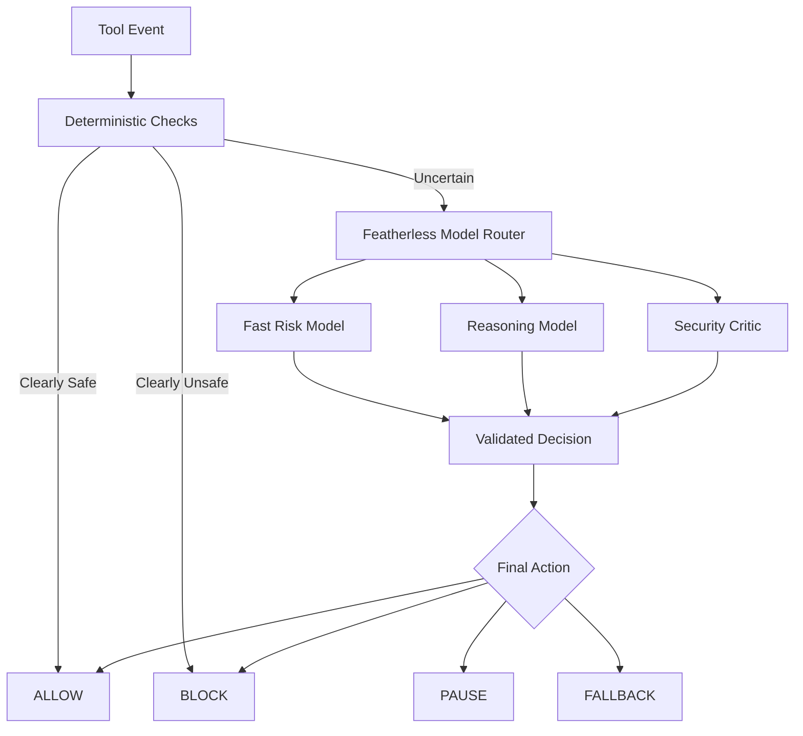
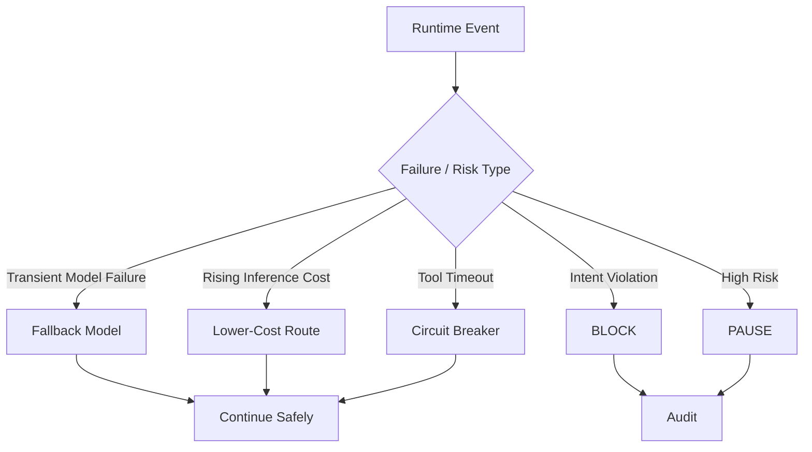
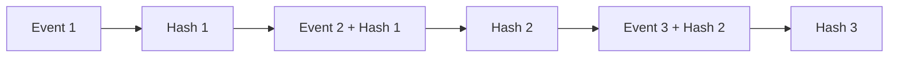
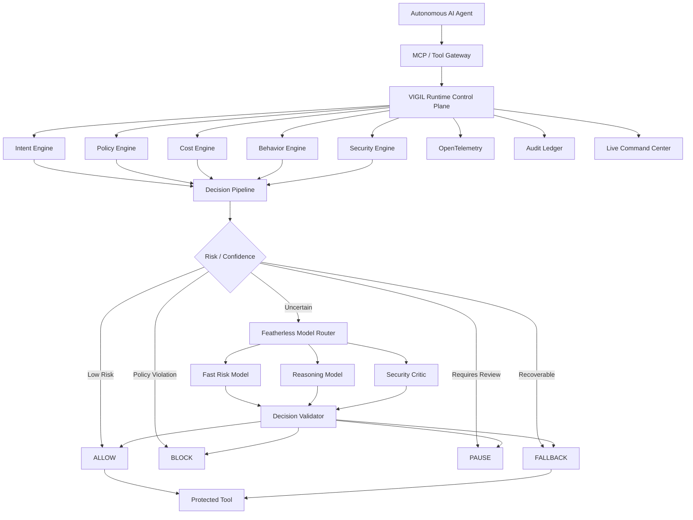
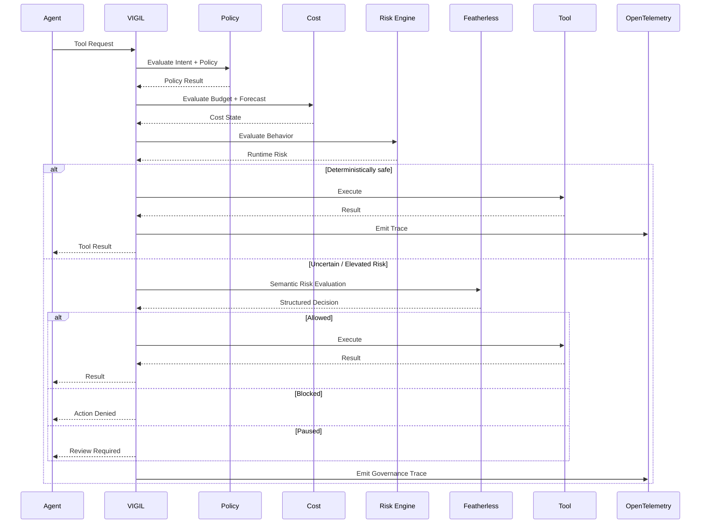
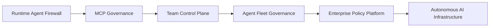
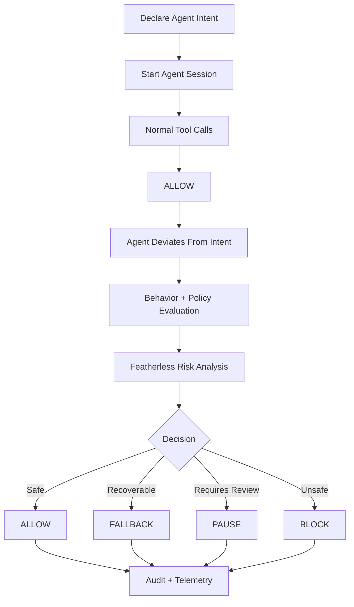

# VIGIL

<p align="center">
  
  
  
  
  
</p>

<p align="center">
  <strong>The Runtime Firewall for Autonomous AI Agents</strong>
</p>

<p align="center">
  Observe · Evaluate · Enforce
</p>

<p align="center">
  <a href="https://vigil-featherless.vercel.app/">Live Dashboard</a> ·
  <a href="https://vigil-server.onrender.com/">API</a> ·
  <a href="https://github.com/LSUDOKO/Vigil">Source</a>
</p>

---

## Overview

**VIGIL** is a runtime governance and control plane for autonomous AI agents.

As agents gain the ability to execute tools, access files, call APIs, run commands, and operate for extended periods, the security boundary moves from the model itself to the **runtime**.

VIGIL sits between the agent and the capabilities it can invoke.

Every governed action can be evaluated against:

* **Intent** — Is the action consistent with the agent's declared objective?
* **Policy** — Is the requested capability permitted?
* **Cost** — Is the session within its configured economic boundary?
* **Behavior** — Is the agent behaving within its expected baseline?
* **Security** — Does the action introduce elevated risk?

VIGIL can then take an explicit runtime action:

**ALLOW · PAUSE · BLOCK · FALLBACK**

For deterministic cases, VIGIL relies on local runtime controls and policy rules. For ambiguous cases, it can escalate to specialized models through **Featherless**.

> **Agents can act. VIGIL decides whether they should.**

---

# The Problem

AI agents are no longer limited to generating text.

They can now:

* read and modify files;
* execute commands;
* search repositories;
* call external APIs;
* access MCP tools;
* interact with development environments;
* perform long-running workflows;
* chain multiple tool calls without a human reviewing every step.

That changes the risk model.

A conventional application usually has a human explicitly initiating a sensitive action.

An autonomous agent can generate a sequence of actions on its own.

The resulting failure modes are different:

```text
Agent
  │
  ├── unexpected tool call
  ├── infinite tool loop
  ├── retry storm
  ├── budget runaway
  ├── policy violation
  ├── unexpected network access
  ├── unsafe command execution
  └── behavioral drift
```

Traditional observability can tell you what happened.

Static policy can tell you what is allowed.

But autonomous systems also require something else:

> **A control layer capable of evaluating the next action before it executes.**

---

# The VIGIL Thesis

The next generation of agent infrastructure needs an enforceable boundary between:

> **what an agent wants to do**

and

> **what the agent is allowed to execute.**

VIGIL makes that boundary explicit.



VIGIL does not replace the agent.

It governs the **execution boundary around the agent**.

---

# Why Now?

Three infrastructure shifts are happening simultaneously.

## 1. Agents are becoming operational

Agents increasingly execute real actions instead of merely answering questions.

## 2. Tool access is expanding

Protocols such as MCP make it easier for agents to interact with files, APIs, repositories, shells, and external systems.

## 3. Model ecosystems are becoming heterogeneous

Developers no longer have to rely on one model provider or one model family.

Featherless currently exposes **43k+ open models**, making model specialization and routing an increasingly practical design pattern.

That creates a new infrastructure question:

> **Who governs the runtime behavior of an agent when the agent itself becomes the execution layer?**

VIGIL is built around that problem.

---

# What VIGIL Does

## 1. Intent-Aware Governance

An operator can declare what an agent is supposed to accomplish.

Example:

```text
Fix the failing tests in this repository.

Allowed:
- read project files
- search code
- modify project files
- run tests

Denied:
- network access
- secrets
- arbitrary shell execution

Maximum budget:
$2
```

VIGIL turns that intent into structured runtime policy.

A compliant action:

```text
run_tests
      ↓
policy evaluation
      ↓
ALLOW
```

A conflicting action:

```text
network request
      ↓
intent / policy evaluation
      ↓
BLOCK
```

The distinction is fundamental:

> **Task intent is not the same thing as tool permission.**

---

# 2. Runtime Tool Interception

VIGIL provides a governance boundary around tool execution.

Depending on the integration, this can cover:

* MCP tools
* file operations
* shell execution
* code search
* repository analysis
* external APIs
* custom agent actions

The governance layer is placed on the runtime path:

```text
Agent
  ↓
VIGIL
  ↓
Governance Decision
  ↓
Tool
```

Rather than:

```text
Agent
  ↓
Tool
  ↓
Log what happened later
```

---

# 3. Predictive Cost Governance

VIGIL does more than report historical cost.

It tracks runtime economics to estimate where a session is heading.

Signals include:

* current spend;
* spend velocity;
* recent usage;
* budget utilization;
* projected cost;
* estimated time to budget exhaustion;
* soft limits;
* hard limits.

Example:

```text
SESSION
────────────────────────────

Current Spend       $0.78
Budget              $2.00
Burn Rate           $0.21/min
Projected Spend     $2.71
Estimated Breach    05:42
```

Possible responses:

```text
WARNING
   ↓
FALLBACK
   ↓
PAUSE
   ↓
HARD STOP
```

This transforms cost from a billing metric into a runtime governance signal.

---

# 4. Adaptive Multi-Model Governance

Not every runtime decision requires the same reasoning capacity.

VIGIL therefore supports tiered model evaluation.



This allows the runtime to optimize across:

**security · latency · cost · reasoning depth**

The goal is not to invoke an expensive model for every event.

The goal is to invoke **the right model at the right point in the decision pipeline**.

---

# 5. AI-Assisted Risk Evaluation

When deterministic rules cannot confidently resolve an event, VIGIL can send structured runtime context to a Featherless-hosted model.

Typical context includes:

* agent intent;
* active policy;
* requested tool;
* tool arguments;
* recent tool history;
* current cost state;
* detected runtime signals.

The model is expected to return structured data:

```json
{
  "risk_score": 94,
  "severity": "HIGH",
  "decision": "BLOCK",
  "intent_violation": true,
  "confidence": 0.96,
  "reasons": [
    "Action is outside declared task scope",
    "External execution path detected"
  ]
}
```

The response must be schema-validated before being used by the runtime.

### Important design principle

> **The model recommends. VIGIL enforces.**

AI output does not automatically override deterministic security boundaries.

---

# 6. Natural-Language Policy Generation

VIGIL can expose policy creation as a natural-language interface.

Example:

```text
Allow repository reads and test execution.
Block network access and secrets.
Limit the session to $2.
Pause unknown shell commands.
```

The generated policy can be normalized into a structured representation:

```yaml
budget:
  soft_limit: 1.60
  hard_limit: 2.00

tools:
  read_file: allow
  search_code: allow
  run_tests: allow
  network: deny
  secrets: deny
  unknown_shell: pause
```

The generated policy is then:

1. schema validated;
2. normalized;
3. checked for unsafe configuration;
4. shown for confirmation;
5. compiled into the runtime engine.

The model creates a policy proposal.

It does **not** receive unrestricted authority over the policy engine.

---

# 7. Behavioral Threat Detection

VIGIL can track behavioral characteristics of agent sessions.

Examples include:

* unusual tool frequency;
* repeated operations;
* retry storms;
* unexpected tool transitions;
* latency anomalies;
* accelerating cost;
* intent violations;
* behavioral drift.

Example:

```text
EXPECTED

read_file
search_code
run_tests

                 ↓

OBSERVED

search_code × 19
run_command × 8
network request × 3

                 ↓

VIGIL

Behavioral Drift     HIGH
Intent Violation     YES
Projected Cost       ABOVE LIMIT

Action                PAUSE
```

This is important because a dangerous agent is not always identified by one obviously malicious request.

Sometimes the signal is:

> **the agent's behavior changed.**

---

# 8. Recovery and Fallback

Runtime governance should not automatically terminate every abnormal session.

Where a safe recovery exists, VIGIL can apply it.



The design principle is:

> **Preserve useful autonomy without surrendering runtime control.**

---

# 9. Tamper-Evident Audit Trail

Every governed action can be represented as an audit event containing information such as:

```text
timestamp
session ID
agent ID
tool
decision
policy
risk
model
cost
reason
trace ID
previous hash
current hash
```

Events can be chained using cryptographic hashes:



This provides a **tamper-evident** execution history for debugging, investigation, and governance evidence.

---

# End-to-End Architecture



---

# Runtime Workflow



---

# Why Featherless?

VIGIL is designed to make model diversity operationally useful.

Featherless provides a large catalog of open models behind a unified inference interface. VIGIL can use that model diversity for different runtime decisions instead of forcing one model to perform every task.

Potential roles:

| Role            | Purpose                                 |
| --------------- | --------------------------------------- |
| Fast Risk Model | High-frequency classification           |
| Reasoning Model | Context-heavy policy/risk analysis      |
| Security Critic | Adversarial review                      |
| Fallback Model  | Resilience when a preferred model fails |

The architectural idea is:

```text
Model abundance
      ↓
Task specialization
      ↓
Adaptive routing
      ↓
Runtime governance
```

---

# Why VIGIL Is Different

### Traditional observability

**See what happened.**

### Static policy

**Define what should be allowed.**

### AI security

**Classify potentially dangerous behavior.**

### VIGIL

**Evaluate the action and control what happens next.**

The distinction is runtime enforcement.

---

# Useful For

## Autonomous Coding Agents

Govern agents that:

* modify repositories;
* execute tests;
* access shells;
* interact with external services;
* operate for extended periods.

## MCP Workflows

Introduce a governance boundary between:

```text
MCP Client
    ↓
VIGIL
    ↓
MCP Tools
```

## Internal AI Platforms

Provide:

* runtime budgets;
* agent policies;
* intervention;
* behavioral monitoring;
* audit trails.

## Agentic Automation

Govern long-running workflows that:

* call multiple tools;
* access external APIs;
* consume inference;
* execute actions automatically.

---

# Product Positioning

VIGIL is designed as an **infrastructure product**, not another consumer-facing AI assistant.

The initial wedge is:

> **runtime governance for autonomous developer and agent workflows.**

Potential users include:

* AI infrastructure teams;
* platform engineering teams;
* developer-tool companies;
* teams operating coding agents;
* MCP ecosystem developers;
* organizations deploying autonomous workflows.

---

# Market Evolution



## Phase 1 — Runtime Protection

* tool interception;
* policy enforcement;
* cost control;
* behavior monitoring;
* runtime intervention.

## Phase 2 — Team Governance

* persistent policies;
* organizations;
* RBAC;
* incident workflows;
* shared dashboards.

## Phase 3 — Enterprise Control

* identity integrations;
* fleet management;
* centralized policy;
* audit retention;
* governance workflows.

## Phase 4 — Agent Infrastructure

* lifecycle management;
* model routing;
* adaptive security;
* cost optimization;
* multi-agent orchestration.

---

# Production Readiness

VIGIL is designed with a production-oriented architecture, but the current project should not be interpreted as a security certification or compliance certification.

A hardened production deployment would additionally require:

* sandbox isolation;
* stronger identity controls;
* persistent policy storage;
* tenant isolation;
* secrets management;
* network controls;
* resource quotas;
* threat-model-specific security testing;
* production incident response;
* formal compliance processes where applicable.

The architecture is intentionally modular so those capabilities can be introduced without replacing the runtime governance core.

---

# Security Principles

## Deterministic First

Use deterministic checks wherever they are sufficient.

## AI Where Reasoning Adds Value

Use model inference for semantic ambiguity instead of trivial authorization.

## Fail Closed

Critical governance failures should not silently produce unrestricted execution.

## Least Privilege

Give agents only the capabilities required for their task.

## Human Override

Operators must be able to pause or terminate execution.

## Explicit Uncertainty

Model confidence is not authorization.

## Traceability

Important runtime decisions should be reconstructable.

## Provider Flexibility

The governance layer should not depend on one model provider.

---

# Observability

VIGIL integrates with OpenTelemetry to correlate execution state across:

```text
Agent
  ↓
Session
  ↓
Tool Request
  ↓
Policy Decision
  ↓
Model Evaluation
  ↓
Runtime Action
  ↓
Cost
  ↓
Tool Result
```

This provides a unified runtime narrative instead of isolated application logs.

---

# Command Center

The operator should be able to answer four questions immediately:

### What is the agent doing?

Live tool activity and execution state.

### Is its behavior normal?

Risk signals and behavioral drift.

### Is it still within policy?

Intent and policy decisions.

### Should it continue?

Explicit runtime action:

```text
ALLOW
PAUSE
BLOCK
FALLBACK
```

---

# Example Runtime

```text
┌────────────────────────────────────────────────┐
│ VIGIL SESSION                                  │
├────────────────────────────────────────────────┤
│ Agent             coding-agent-01              │
│ Intent            Fix repository tests         │
│ Status            PAUSED                       │
│ Risk              HIGH                         │
│ Current Cost      $0.78                        │
│ Budget            $2.00                        │
│ Projected Cost    $2.71                        │
├────────────────────────────────────────────────┤
│ LAST ACTION                                    │
│ run_command("curl ... | bash")                 │
│                                                │
│ Intent Violation: YES                          │
│ Security Risk: HIGH                            │
│ Model Review: Featherless                      │
│ Decision: BLOCK                                 │
└────────────────────────────────────────────────┘
```

---

# Technology Stack

| Layer           | Technology                       |
| --------------- | -------------------------------- |
| Runtime         | Go                               |
| Agent Protocol  | Model Context Protocol           |
| Governance      | Custom runtime policy engine     |
| AI Inference    | Featherless                      |
| Frontend        | Next.js / React                  |
| Styling         | Tailwind CSS                     |
| Real-Time State | WebSockets                       |
| Observability   | OpenTelemetry                    |
| Telemetry       | SigNoz                           |
| Authentication  | OAuth 2.1 / PKCE                 |
| Agent SDK       | Python                           |
| Testing         | Go testing · Pytest · Playwright |
| Packaging       | Docker                           |
| Deployment      | Container-based infrastructure   |

---

# Repository Structure

```text
vigil/
├── cmd/
│   ├── vigil-server/
│   └── vigil-cli/
│
├── pkg/
│   ├── governance/
│   ├── policy/
│   ├── cost/
│   ├── behavior/
│   ├── security/
│   ├── router/
│   ├── telemetry/
│   └── audit/
│
├── frontend/
├── sdk/
├── demo/
├── tests/
├── integrations/
├── docs/
│
├── Dockerfile
├── docker-compose.prod.yaml
├── .env.example
├── SECURITY.md
└── README.md
```

---

# Quick Start

## Requirements

* Go `1.24+`
* Node.js `20+`
* Docker
* Featherless credentials for live model evaluation
* Optional SigNoz/OpenTelemetry configuration

## Clone

```bash
git clone https://github.com/LSUDOKO/Vigil.git
cd Vigil
```

## Configure

```bash
cp .env.example .env.local
```

Configure the required environment variables.

> Never commit credentials or API keys.

---

# Run the Backend

```bash
go run cmd/vigil-server/main.go
```

---

# Run the Dashboard

```bash
cd frontend
npm install
npm run dev
```

Open:

```text
http://localhost:3000
```

---

# Docker

```bash
docker compose -f docker-compose.prod.yaml up --build
```

---

# Testing

## Go Tests

```bash
go test ./...
```

## Python Integration Tests

```bash
cd tests
uv run pytest integration/
```

## End-to-End Tests

```bash
cd tests/e2e
npm install
npx playwright test
```

## Runtime Verification

```bash
python3 demo/verify.py
```

---

# Demo Flow

The recommended VIGIL demonstration is:



The most important moment is:

> **An agent attempts an action that it was not authorized to perform, VIGIL detects the violation, evaluates the risk, and stops the action before execution.**

---

# Hackathon Context

VIGIL is built for the **Impact Forge: Summer 2026 Hackathon** under the **General Innovation** track.

The project directly targets the track's focus on:

* developer tooling;
* automation workflows;
* full-stack applications;
* real-world utility.

The implementation emphasizes a complete runtime governance workflow rather than a broad collection of disconnected AI features.

The project is also designed around the hackathon's emphasis on:

**technical execution · originality · utility · demo quality**

---

# Why This Problem Matters

The first wave of AI infrastructure focused on making models:

> **more capable.**

The next wave must make autonomous systems:

> **more controllable.**

When an agent can execute software, interact with tools, and operate for extended periods, intelligence alone is not enough.

The system also needs:

* boundaries;
* accountability;
* cost controls;
* runtime policy;
* intervention;
* observability.

VIGIL is built around that execution boundary.

---

# Vision

We believe autonomous agents will become a fundamental software primitive.

They will write code.

Operate infrastructure.

Analyze data.

Run workflows.

Interact with APIs.

Manage systems.

The infrastructure question will therefore evolve from:

> **“Can this agent do it?”**

to:

> **“Should this agent be allowed to do it?”**

VIGIL aims to become the runtime layer that answers that question.

---

# VIGIL

## **Observe what agents do.**

## **Understand the context.**

## **Control what happens next.**

**Runtime Governance · Adaptive Security · Cost Control · Policy Enforcement · Agent Observability**

---

# Current Status

VIGIL is an actively developed, production-oriented runtime governance prototype.

The repository contains both implemented functionality and experimental components. Features should be considered according to their current implementation and verification status rather than interpreted as security certifications or production guarantees.

For the latest implementation details, consult the repository's implementation notes and test results.

---

# Live Resources

* **Dashboard:** https://vigil-featherless.vercel.app/
* **API:** https://vigil-server.onrender.com/
* **Source:** https://github.com/LSUDOKO/Vigil

---

# References

* [Featherless](https://featherless.ai/)
* [Featherless Model Catalog](https://featherless.ai/models/)
* [Model Context Protocol](https://modelcontextprotocol.io/)
* [OpenTelemetry](https://opentelemetry.io/)
* [SigNoz](https://signoz.io/)

---

# License

MIT

---

## Disclaimer

VIGIL is experimental infrastructure.

It does not provide a guarantee of secure or compliant autonomous execution, and it is not a substitute for application security, sandboxing, identity management, network isolation, or formal compliance programs.

Production deployments should be independently threat-modeled, tested, and hardened for their specific environment.
