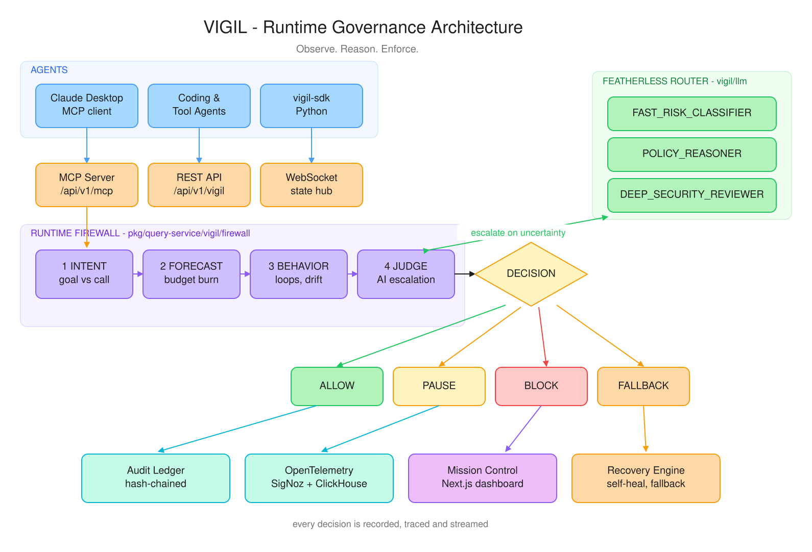
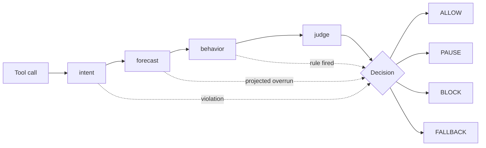

# VIGIL Architecture

This document describes how a single agent tool call travels through VIGIL and
becomes an enforced runtime decision. It is the reference companion to the
overview in the [root README](../../README.md).



> The diagram above is generated from [`vigil-architecture.excalidraw`](vigil-architecture.excalidraw),
> which is the editable source of truth. Open it at [excalidraw.com](https://excalidraw.com/#json=rcH0_OKQW2a87TecsV8Mp,HANWgeFvmjOjvLMKsgZXsw)
> or drag the file into any Excalidraw canvas. After editing, regenerate the SVG:
>
> ```bash
> python3 scripts/diagrams/render_excalidraw_svg.py \
>     docs/architecture/vigil-architecture.excalidraw \
>     docs/architecture/vigil-architecture.svg
> ```

---

## 1. Layers

| Layer | Package | Responsibility |
| ----- | ------- | -------------- |
| Ingress | [`vigil/mcp`](../../pkg/query-service/vigil/mcp) | MCP protocol server, tool registry, sandboxed execution |
| Ingress | [`vigil/appserver`](../../pkg/query-service/vigil/appserver) | REST surface under `/api/v1/vigil/*`, authorization, dependency wiring |
| Ingress | [`vigil/state`](../../pkg/query-service/vigil/state) | Live agent/session hubs streamed to the dashboard over WebSocket |
| Decision | [`vigil/firewall`](../../pkg/query-service/vigil/firewall) | The staged decision pipeline; owns the final verdict |
| Decision | [`vigil/engine`](../../pkg/query-service/vigil/engine) | Pluggable detector rules evaluated against agent context |
| Decision | [`vigil/policy`](../../pkg/query-service/vigil/policy) | Policy store, evaluation, and natural-language policy generation |
| Decision | [`vigil/cost`](../../pkg/query-service/vigil/cost) | Per-session cost tracking and budget policy |
| Intelligence | [`vigil/llm`](../../pkg/query-service/vigil/llm) | Tiered model router, provider chain, deterministic fallback |
| Response | [`vigil/recovery`](../../pkg/query-service/vigil/recovery) | Self-healing actions when a rule fires |
| Evidence | [`vigil/audit`](../../pkg/query-service/vigil/audit) | Hash-chained, tamper-evident event ledger |
| Evidence | [`vigil/telemetry`](../../pkg/query-service/vigil/telemetry) | OpenTelemetry spans and span events |
| Analysis | [`vigil/dna`](../../pkg/query-service/vigil/dna) | Behavioral profiling of an agent's normal execution shape |
| Analysis | [`vigil/replay`](../../pkg/query-service/vigil/replay) | Prompt/decision replay and diffing |

---

## 2. The decision pipeline

Every governed tool call enters `Firewall.Check` and leaves with exactly one
`Decision` plus the `Stage` that produced it — so the dashboard can always
explain *why*, not just *what*.



| Stage | Constant | What it asks |
| ----- | -------- | ------------ |
| 1 | `StageIntent` | Is this call consistent with the session's declared objective? |
| 2 | `StageForecast` | Does the projected spend breach the session budget? |
| 3 | `StageBehavior` | Do the registered detector plugins see a loop, drift, or anomaly? |
| 4 | `StageJudge` | Model escalation when the deterministic layers cannot decide |
| — | `StageDefault` | Nothing objected; the call is allowed |

Deterministic stages run first and can short-circuit to a decision on their
own. Inference is reached only when the cheaper layers are inconclusive.

---

## 3. Model routing

Escalation is tiered, not uniform. `llm.Tier` describes how much scrutiny a
call has earned, and the router maps that tier onto model roles:

| Tier | Meaning | Roles consulted |
| ---- | ------- | --------------- |
| `TierNormal` | Deterministic checks satisfied | none — no inference |
| `TierSuspicious` | A low/medium signal fired | `FAST_RISK_CLASSIFIER` |
| `TierUncertain` | High-severity signal, or policy could not decide | `POLICY_REASONER` |
| `TierHighRisk` | Reasoning plus independent review | `POLICY_REASONER` + `DEEP_SECURITY_REVIEWER` |

The router records per-model request counts, failures, fallbacks, latency, and
token usage, which the dashboard's model panel reads over the REST API. The
provider is a failover `Chain`, so a degraded vendor is visible rather than
silently absorbed.

---

## 4. Evidence

Every decision fans out to three independent sinks:

- **Audit ledger** — an append-only, hash-chained record. `/api/v1/vigil/audit/verify`
  re-walks the chain and reports the first broken link, so tampering is detectable
  rather than merely discouraged.
- **OpenTelemetry** — each decision is a span, each rule violation a span event,
  exported to SigNoz/ClickHouse for trace-level forensics.
- **State hub** — decisions are broadcast over WebSocket to Mission Control for
  live operator visibility and manual pause/kill.

---

## 5. API surface

| Method | Path | Purpose |
| ------ | ---- | ------- |
| `GET` | `/api/v1/vigil/decisions` | Recent firewall decisions |
| `GET` | `/api/v1/vigil/audit` | Audit ledger entries |
| `GET` | `/api/v1/vigil/audit/verify` | Verify the hash chain |
| `GET` | `/api/v1/vigil/models` | Model router status and per-model stats |
| `GET` | `/api/v1/vigil/forecast` | Global budget forecast |
| `GET` | `/api/v1/vigil/governance/rules` | Registered detector rules |
| `POST` | `/api/v1/vigil/policy/draft` | Draft a policy from natural language |
| `POST` | `/api/v1/vigil/policy/draft/{id}/confirm` | Promote a draft to an active policy |
| `GET` | `/api/v1/vigil/sessions/{id}/forecast` | Per-session budget projection |
| `POST` | `/api/v1/vigil/sessions/{id}/intent` | Declare a session's objective |
| `GET` | `/api/v1/vigil/sessions/{id}/policy` | Effective policy for a session |
| `GET` | `/api/v1/mcp` | MCP SSE endpoint for agent clients |

See [`docs/api/openapi.yml`](../api/openapi.yml) for the full specification.

---

## 6. Design principles

- **Deterministic first.** Security-critical checks stay deterministic wherever
  they can be. Inference is an escalation path, not the default path.
- **Fail closed.** A governance failure must not degrade into unrestricted
  execution.
- **Explain the verdict.** Every decision carries the stage, reason, and — when
  a model was consulted — the model ID and risk score.
- **Provider independence.** The governance layer treats inference as a
  swappable chain, never a hard dependency on one vendor.
